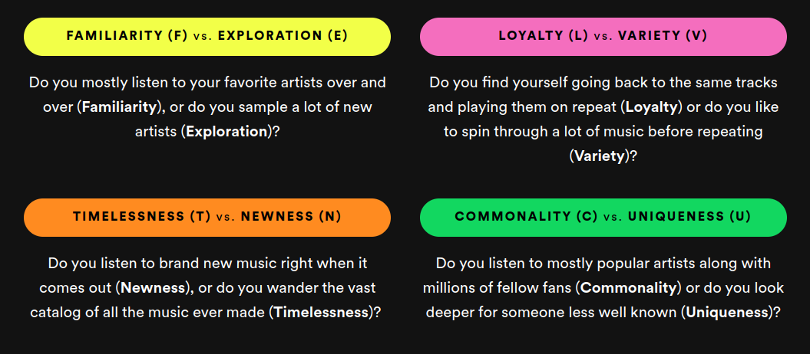
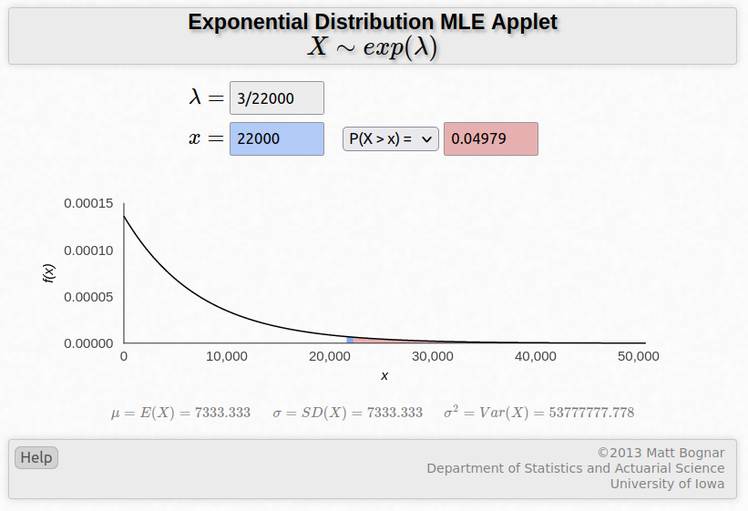

# Spotify Wrapped Data Feed 
## Steps to run the files
To set up the environment: `run conda env create -f conda.yaml`  
To activate it: `conda activate stream_analytics_project`  
  
You need to make sure to have `artists.csv`, `tracks.csv`, and `tracks_extended.csv` in the data folder, or specify the paths to the datasets in the main function of `src/data_generator.py` for the functions `serialize_song_data`('[tracks.csv dataset path](https://www.kaggle.com/datasets/yamaerenay/spotify-dataset-19212020-600k-tracks?select=tracks.csv), '[tracks_extended.csv dataset path](https://www.kaggle.com/datasets/amitanshjoshi/spotify-1million-tracks)'), and `serialize_artist_data`('[artists dataset path](https://www.kaggle.com/datasets/yamaerenay/spotify-dataset-19212020-600k-tracks?select=tracks.csv)')  
  
To run the simulation and populate the tables: `python3 main.py`

## Overview
This repository contains the code and documentation for generating synthetic data for Spotify Wrapped using the AVRO format. The synthetic data generation scripts provided here are designed to align with the needs of our project, facilitating data analysis, testing, and development in a controlled environment.

## Introduction 
The objective of this project is to design a data feed for Spotify Wrapped, a feature that provides users with insights into their listening habits over the past year. The data feed includes various aspects such as song plays, skips (implicitly), and other relevant data. In this report, we discuss the development process of an AVRO schema for the Spotify Wrapped data feed and the creation of scripts to generate synthetic data mimicking user streaming experiences.

## AVRO Format Choice 
### Datasets 
To finalize the dataset that we were using for the project, we needed to merge two datasets as one included songs but no genre feature, and the other had no release date which is really important to calculate the newness score that will be later used in generating user events. As such, we did an inner join on the common song names between these datasets to keep the songs in the first dataset while introducing the genres column. Additionally, we merged the resulting dataset  with the artist dataset on the common artists to get the artist popularity and the artist's number of followers. 

### Transformations
We also had to do some transformations. We applied K Means clustering to audio features in the track table after using StandardScaler to assign each track to one of the clusters based on its audio features and added a new column `audio_features_type` to the dataset indicating the cluster each track belongs to. Furthermore, we created a newness score for each track based on the release date. We created a mask to identify release dates that are represented by 2024 only. For these dates, we calculate the number of months elapsed since the release date up until January 1, 2024, and compute the newness score that falls between 0 and 1 for each track using a normalization function. 0 represents older songs while 1 represents newer songs. 

### Tables 
Our group decided on 4 tables. The AVRO schema defines these entities along with their respective attributes and relationships.
1. **User**: to generate Spotify users, we used the Faker and datetime libraries to provide us with a list of users including a `user_id`, `username`, `location`, `birthdate`, and `gender`. We defined the type of each variable based on our knowledge of previous similar variables we have seen and used in other datasets.
2. **Track**: introduced variables that were included in the dataset we chose, including `track_id`, `duration`, `artist`, `name`, `popularity`, `release date`, and many more. The type of each variable was defined based on the original type of the variable in the two datasets we used to generate data.
3. **Artist**: contained the `id`, `followers`, `name`, and `popularity` variables, all of which were also defined by the type that was given in the original artist dataset.
4. **UserEvent**: This table records whenever a track is played by a user. It contains an `id` for the record, a `timestamp` for when this record occurred, the `track_id` of the track that was played, the `user_id` of the user that played the track, and the `listening_time`, expressed in milliseconds.

## Design of Synthetic Data Generation Scripts
The synthetic data generation process starts with defining the data schema. The AVRO schema of the previous tables as defined in the file `src/serializer.py`.  
Our synthetic data generation scripts involve simulating the streaming experiences of n individual users (in our cases 10,000 users). 

We have developed Python scripts to generate realistic, time-series data reflecting typical user interaction patterns with Spotify's streaming service. Key components of the script include:
- **User Profile Generation**: Random generation of n user profiles including demographics (birthdate, gender, location). `src/data_generator.py`: `generate_fake_users(n_users=10000)`.
- **User Events Simulation**: Generation of user-events (song plays) based on randomly assigned personalities and on probabilistic models `src/data_generator.py`: `generate_all_user_events()`.

## User Events Simulation
The Events simulation uses 4 classes that were defined in `src/simulation_objects.py`:
- `Personality()`: This object contains a randomly generated personality that will influence the user events in the simulation.
- `Track()`: This object stores the `track_id` and `listening_time` variables.
- `Session()`: This object represents a "session" of listening to music.
- `User()`: This object represents individual users, and contains the methods to simulate their listening behavior.  
  
The simulation works by looping through every user that was generated in the users.avro table, and running the method `simulate_user_events()` of the `User()` class. The `simulate_user_events()` takes a start_date as an argument, which by default is the 1st of January 2024. It will then simulate the daily listening behavior for the given user, every day starting from the start_date until the current date.  
  
Regarding the daily simulations, we have decided to group them into sessions, because, in reality, it is more common to listen to several songs in a row than to randomly play songs with pauses in between throughout the day.  
Every day, every user initializes some sessions (long sessions and short sessions). Each one of these sessions initializes some songs that will be played, by drawing from a normal distribution with different parameters depending on the type of session.

Once we have the sessions and the number of songs for each one of them, we need to decide on which songs will be played (we will come back to this in a moment). Then, we schedule these sessions throughout the day for a given user with the method `allocate_sessions()` of the User object.  
  
Going back to the choice of songs, the main challenge here was to generate some data that would allow us to classify the users along one of the 16 personality types of Spotify. These 16 personalities are built on the following 4 dimensions:  

  
Looking at these 4 dimensions, we can think about them as two separate groups in the way we approach the selection of the tracks that will be played by the user:
- **Dimensions that modify the subset of songs that we draw from**: Familiarity/Exploration, Loyalty/Variety
- **Dimensions that modify the weights or the order of the songs that we draw**: Timelessness/Newness, Commonality/Uniqueness.
  
In our approach, we define the 8 characteristics as follows:  
  
- Familiarity: If a user has the familiarity trait, it means that he will have a higher chance of listening to an artist he has already played before.
- Exploration: If a user has the exploration trait, he will have a lower chance of listening to an artist he has already played before (lower in relative terms compared to a user with familiarity)
  
- Loyalty: If a user has the loyalty trait, he will be more likely to listen to the same artist he listened to previously, or to listen to the same song he previously played.
- Variety: By contrast to loyalty, will have a lower probability of playing the same song or same artist.
  
- Timelessness: The user will be more likely to play older songs all else equal.
- Newness: The user will be more likely to play newer songs all else equal.
  
- Commonality: The user listens to mainstream songs/artists.
- Uniqueness: The user listens to more niche songs/artists.

At every iteration of the loop, when a user needs to select the next song to play, he will be either assigned as a **"very loyal"** user (meaning he will play the same song), a **"loyal"** user (meaning he will play a song from the same previous artist), a **"familiar"** user (meaning he will play a song from an artist he already played previously), or none of the previous categories, meaning he will randomly sample from the entire distribution of songs. Naturally, if a user has the trait `loyalty` in his `Personality()` type, he will be more likely to be **"very loyal"** or **"loyal"** at any given iteration. Likewise, if a user has the trait `familiarity`, he will be more likely to be a **"familiar"** user at any given iteration.  
  
Once we determine the subset of songs that we sample from, we need to rank those options according to some criteria. Here, we want to make sure that users with the trait `timelessness` prefer older songs, while users with the trait `newness` prefer newer songs. For this reason, we rank the songs based on their release date (or the transformed version of it that we stored as their `newness_score`). The order of the sorting depends on the trait (timelessness will be sorted in ascending order while newness in descending order). Then, we sample from the songs with an exponential distribution, because we want the users to have even higher probabilities of randomly selecting songs matching their personalities.  

The lambda parameter of the exponential distribution that we decided to go with is "3/n_songs" (as you can see on the plot), because we have found that this value gives a reasonably low probability of the x sampled being greater than the total number of songs we sample from (in which case we just take the last song).

Regarding the fourth dimension of **Commonality/Uniqueness**, we could have used the popularity of artists, or even computed our metrics during the simulation to keep track of mainstream and not-so-mainstream songs. However, we decided that we do not need to use it in the synthetic data generation, because naturally, by a random process, some users will end up choosing mainstream artists/songs while others will go for less popular songs, so this is rather a characteristic that we will observe in the analytics phase of the project to classify our simulated users into one of the 16 personalities of Spotify Wrapped. 
  
Finally, another important piece is the `listening_time` variable. We want to simulate the fact that sometimes users don't listen to a song from start to finish but skip to the next song. Therefore, in some records (1/3 of the records in this version), we say that the user will skip the song after some seconds x that is sampled from an exponential distribution with `lambda = 1/song_duration`. This means that the longer the user listens to the song, the less likely he is to skip it, which is a realistic assumption.

## Limitations
Some limitations of synthetic data generation include:
- The fact that the sessions are allocated with a structure of 24 blocks of 1 hour each, means that all the users will start their sessions by playing a song at an exact hour (like 2:00 PM or 3:00 PM). No user will play their first song of a session at say 2:24 PM. (However, the timestamp we are recording is off when the song has finished being played (ended or skipped))
- If a user skips a song, there is virtually no reason why he would play it again right after (in real life). However, in our simulation, it is not impossible that a user who has just skipped a song would play it again right after if he was randomly assigned to being a **"very_loyal"** user at that given iteration of `get_next_song()`.

## Challenges Encountered
The main challenges we encountered were:
- Designing the process of the simulation. 
- Designing the mechanisms of personality traits.
- Translating the designs into code.

## Alignment of the Synthetic Data with Project Needs
The synthetic data generated closely aligns with the project's needs by providing a representative sample of user interactions and streaming experiences. It comprehensively reflects a similar structure to that seen in real-world data. The data feed enables analytics and insights generation for Spotify Wrapped, facilitating personalized user experiences and recommendations. Moving forward, continuous refinement and expansion of the data feed will further enhance its utility and relevance in understanding user preferences and enhancing the Spotify experience.

## Credits
The authors of this project are:
1. Taha Yassine Moumni
2. Mehdi Zaid
3. Maria Sawalha
4. Mateo Ploquin 
5. Abdallah Ghaddar
6. Talal Shehadeh
